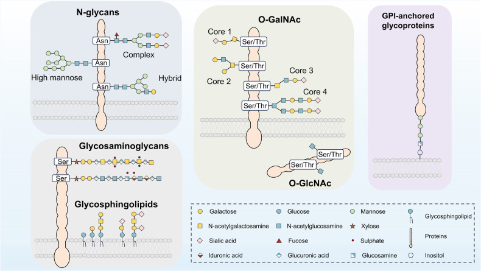
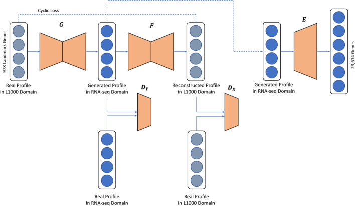

<!-- _class: lead -->

# Drug-induced Rewiring of Glyco-epitope Potential in Hepatocellular Carcinoma

Tatsuya Koreeda ・ 2026-06-29

---

<!-- _class: section -->

01

# Background

---

BACKGROUND

## なぜ Glyco-epitope × HCC か

**糖鎖エピトープ（glyco-epitope）は細胞表面の分子インターフェース**
- レクチン・抗体・glycan-reader に認識される標的
- バイオマーカー・抗体医薬として臨床応用あり

**HCC では糖鎖修飾異常が広く観察される**
- Core fucose 増加（AFP-L3 が代表的バイオマーカー）
- STn、Lewis 抗原など複数の glyco-epitope が腫瘍で発現

**未解決の問い：どの薬剤がどの glyco-epitope を変化させるか？**
- 体系的な理解がない → 本研究で解決する

---

BACKGROUND

## 糖鎖修飾のタイプと glyco-epitope

図: He et al., Signal Transduct Target Ther 2024 (CC BY 4.0)

---

RESEARCH CONCEPT

## 研究の枠組み

  

Drug-induced transcriptome

LINCS L1000 + CycleGAN

  
↓

  

Glycogene program

各薬剤の glycogene 発現プロファイル

  
↓

  

Glyco-epitope potential

glyco-targetability score 算出

  
↓

  

Lectin / antibody / biomarker / glycan-reader

との接続

  
↓

  

Glyco-targetability マップ

HCC 文脈

<b>データ：</b>HepG2 細胞株 × LINCS L1000 薬剤応答
<b>先行：</b>2nd paper の glycogene 機能モジュールを活用

L1000 ⇄ RNA-seq 変換（CycleGAN） 図: Jeon et al., BMC Bioinformatics 2022 (CC BY 4.0)

